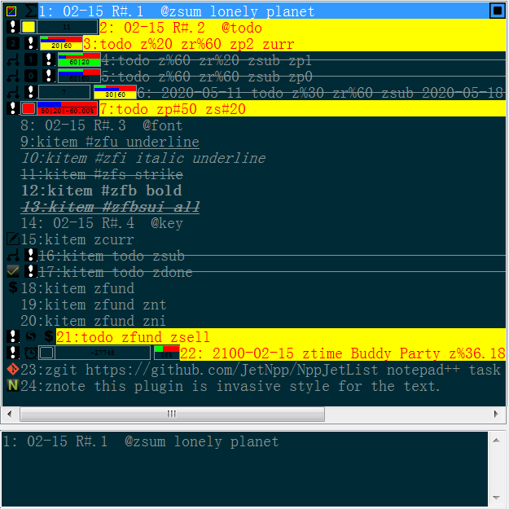

# NppJetList
Notepad++ Task list plugin.

## download

[Release](https://github.com/JetNpp/NppJetList/tree/master/bin "Release")

## demo

[Demo](https://github.com/JetNpp/NppJetList/tree/master/doc/demo.cs "Demo")

## install
- install [Visual C++ Redistributable for Visual Studio 2019](https://learn.microsoft.com/en-us/cpp/windows/latest-supported-vc-redist?view=msvc-170)
- copy the .DLL file into the plugins folder within your Notepad++ installation folder (e.g. \Program Files (x86)\Notepad++\plugins\NppJetList for x86 version).

## change log
#### 0.001.31 2023-07-02
- +. support zfund
- +. support search plot

#### 0.001.31 2022-10-18
- +. background color from style

#### 0.001.31 2022-08-15
- +. build x86 & x64

### compile env
|env   | ver|
| - | - |
|__compiler__|MSVC 2019|
